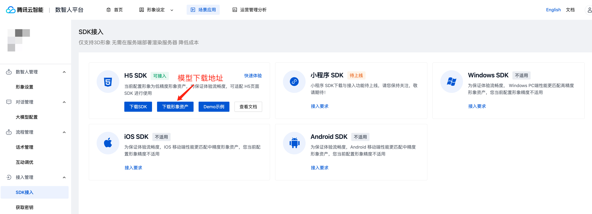

<p align='center'>
  English | <a href="https://github.com/TencentCloud/virtualman-render-demo/blob/main/README.zh-CN.md">中文</a>
</p>

# Tencent Cloud Virtual Man render H5 demo

This project includes both client-side rendering and server-side rendering methods. For client-side rendering, refer to [client-render-demo](https://github.com/TencentCloud/virtualman-render-demo/tree/main/client-render-demo), and for server-side rendering, refer to[server-render-demo](https://github.com/TencentCloud/virtualman-render-demo/tree/main/server-render-demo)

## Project Structure

- `client-render-demo`: Client-side rendering example
- `server-render-demo`: Server-side rendering example

## Installation and Usage

### Environment Requirements

Chrome

### Installation

Copy the project code to your local machine.

### Running the Example

#### Client-side Rendering Example

1. Open the `client-render-demo` directory.
2. Start a local server in this directory.
3. Open the `index.html` file in your browser. If you are using a local server, you can do this by visiting `http://localhost:3000/index.html`.
4. Download the model data.
    
5. Copy the corresponding 3D model data to the local `model` folder and modify the `meta.json` content in the model folder according to the model name.

    Directory structure for the `model` files:
    ```
    model
    ├── action
    │   ├── listening.json
    │   ├── kending.json
    │   └── ...
    ├── config.json
    ├── meta.json
    └── model.glb
    ```
    Modify the meta.json file based on the actual model name:
    ```
    {
        "modelPath": "model.glb",
        "actionPaths": [
            "action/listening.json",
            "action/kending.json",
            ...
        ],
        "configPath": "config.json"
    }
    ```
    If the downloaded model does not have a `config.json` file, you need to remove the `configPath` configuration item from the `meta.json` file.
6. Add the execution URL parameters, for example: `http://localhost:3000/index.html?virtualmanKey=xxxx&sign=xxxx&config=xxxx`.
 - `virtualmanKey`:  Unique identifier for the image. You can obtain this value by [getting the key](https://cloud.tencent.com/document/product/1240/104050#2e81fe93-d83f-4d22-b916-5d1d427d577f) and following the specified steps.
 - `sign`: Signature. Please note that URL encoding is not required here. This can also be obtained by visiting[getting the key](https://cloud.tencent.com/document/product/1240/104050#2e81fe93-d83f-4d22-b916-5d1d427d577f).

#### Server-side Rendering Example

1. Open the `server-render-demo` directory.
2. Start a local server in this directory.
3. Open the `index.html` file in your browser. If you are using a local server, you can do this by visiting `http://localhost:3000/index.html`.
4. Add the execution URL parameters, for example: `http://localhost:3000/index.html?virtualmanKey=xxxx&sign=xxxx`.
 - `virtualmanKey`: Unique identifier for the image. You can obtain this value by [getting the key](https://cloud.tencent.com/document/product/1240/104050#2e81fe93-d83f-4d22-b916-5d1d427d577f) and following the specified steps.
 - `sign`: Signature. Please note that URL encoding is not required here. This can also be obtained by visiting [getting the key](https://cloud.tencent.com/document/product/1240/104050#2e81fe93-d83f-4d22-b916-5d1d427d577f)。

### Speech Recognition Capability
 If you need to enable ASR, you need to add the secretId, secretKey, and appId parameters in the URL parameters.