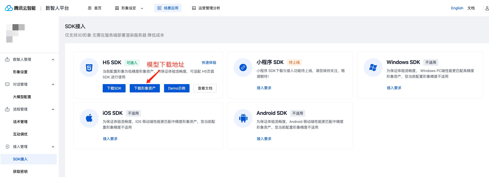

<p align='center'>
 <a href="https://github.com/TencentCloud/virtualman-render-demo/blob/main/README.md"> English</a> | 中文
</p>

# 腾讯云数智人H5渲染 使用示例

本项目包含端渲染和服务器渲染两种方式。其中端渲染参考[client-render-demo](https://github.com/TencentCloud/virtualman-render-demo/tree/main/client-render-demo)，服务器渲染参考[server-render-demo](https://github.com/TencentCloud/virtualman-render-demo/tree/main/server-render-demo)

## 项目结构

- `client-render-demo`: 端渲染示例
- `server-render-demo`: 服务器渲染示例

## 安装和使用

### 环境要求

chrome浏览器。

### 安装

将项目的代码复制到本地。

### 运行示例

#### 端渲染示例(for 3D形象)

1. 打开 `client-render-demo` 目录。
2. 在此目录中启动一个本地服务器。
3. 在浏览器中打开`index.html`文件。如果你正在使用本地服务器，你可以通过访问`http://localhost:3000/index.html`来做到这一点。
4. 下载模型数据。
    
5. 将对应的3D形象模型数据复制到本地的`model`文件夹中，并根据模型名称修改`model`文件夹中的`meta.json`内容。

    本地模型文件目录结构如下：
    ```
    model
    ├── action
    │   ├── listening.json
    │   ├── kending.json
    │   └── ...
    ├── config.json
    ├── meta.json
    └── model.glb
    ```
    在`meta.json`文件中，根据实际模型名称进行以下修改：
    ```
    {
        "modelPath": "model.glb",
        "actionPaths": [
            "action/listening.json",
            "action/kending.json",
            ...
        ],
        "configPath": "config.json"
    }
    ```
    如果下载的模型中没有`config.json`文件，则需要从`meta.json`中删除`configPath`配置项。
6. 添加执行的URL参数，例如：`http://localhost:3000/index.html?virtualmanKey=xxxx&sign=xxxx`。
 - `virtualmanKey`: 形象唯一标识。你可以通过[获取密钥](https://cloud.tencent.com/document/product/1240/104050#2e81fe93-d83f-4d22-b916-5d1d427d577f)并按照指定的步骤来获取这个值。
 - `sign`: 签名。请注意，这里不需要进行 URL 编码。同样可以通过访问[获取密钥](https://cloud.tencent.com/document/product/1240/104050#2e81fe93-d83f-4d22-b916-5d1d427d577f)获取。

#### 服务器渲染示例

1. 打开 `server-render-demo` 目录。
2. 在此目录中启动一个本地服务器。
3. 在浏览器中打开`index.html`文件。如果你正在使用本地服务器，你可以通过访问`http://localhost:3000/index.html`来做到这一点。 
4. 添加执行的URL参数，例如：`http://localhost:3000/index.html?virtualmanKey=xxxx&sign=xxxx`。
 - `virtualmanKey`: 形象唯一标识。你可以通过[获取密钥](https://cloud.tencent.com/document/product/1240/104050#2e81fe93-d83f-4d22-b916-5d1d427d577f)并按照指定的步骤来获取这个值。
 - `sign`: 签名。请注意，这里不需要进行 URL 编码。同样可以通过访问[获取密钥](https://cloud.tencent.com/document/product/1240/104050#2e81fe93-d83f-4d22-b916-5d1d427d577f)获取。

### 语音识别能力
 如果需要开启 ASR，需要在 URL 参数中添加 secretId、secretKey 和 appId参数，。